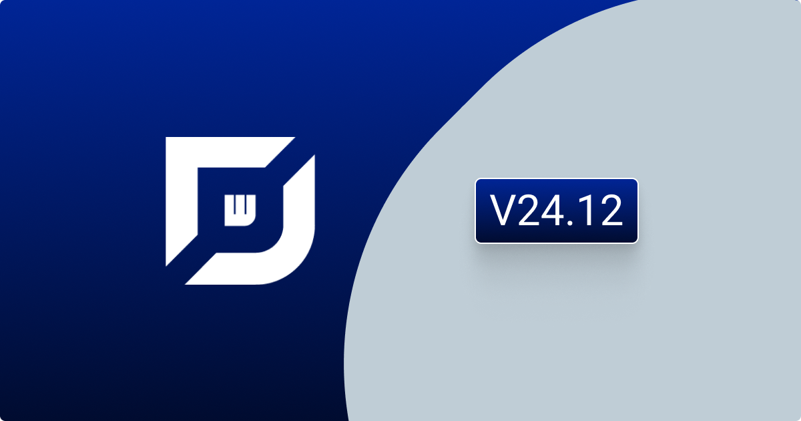

webforJ version 24.12 is live and available for development. Learn more about what main features and fixes are included in this release.

<!-- truncate -->

# 24.12

As always, see the [GitHub release overview](https://github.com/webforj/webforj/releases/tag/24.12) for a more comprehensive list of changes. Highlighted below are some of the most exciting changes:

## Breaking changes 🛠

With the introduction of the routing overhaul outlined below, it's now necessary to restrict webforJ projects to contain **only one class extending `App`**. Read more below, and in the docs about the routing solution introduced in this release.

## New features and enhancements 🎉

The following new components, features, and enhancements to various existing behavior have been introduced in this release:

### Routing support

Version 24.12 introduces Routing in webforJ, a critical feature that significantly enhances navigation within your web apps. Routing allows you to define different paths/routes within your app, enabling users to navigate between different views or pages, access crucial information, or manipulate the page without refreshing the entire app.

To start using routing in your project, include the `Routify` annotation in the class extending the `App` class:

```java
@Routify(packages = "com.webforj.samples.views", debug = true)
@AppTitle("webforJ Samples")
public class Application extends App {
  @Override
  public void run() throws WebforjException {
    console().log("Test");
  }
}
```

To register a `Route` in webforJ, developers can manually specify the route type by setting `Route.Type` in the `@Route` annotation, or omit the type if classes end in `View` or `Layout`. 

```java
@Route
@FrameTitle("Example View")
public class ExampleClassView extends Composite<Div> {
  //...
}
```
Routing in webforJ has many uses, and a [more comprehensive overview](../../docs/routing/overview) of these use cases, as well as the various features and capabilities available to developers. 

### `AppLayout` enhancement

The `AppDrawerToggle` component has been added in `24.12`. This lightweight component has been included to allow developers to easily include a way to toggle the `AppLayout` component's drawer section if it's desired within an app.

Including this within your `AppLayout` is simple - simply add the component to the layout, commonly done in the toolbar at the top, and the component will automatically take care of the toggling capability.

```java
AppLayout layout = new AppLayout();
layout.addToHeader(new AppDrawerToggle());
```

### `Toolbar` component

Another addition with this release is the `Toolbar` component. `Toolbars` are a fundamental part of modern web applications, offering users quick access to core actions and navigation elements. Whether it's for managing page controls or housing key functionalities like search and notifications, the `Toolbar` is now available for webforJ projects.

:::tip Using the `Toolbar`
The `Toolbar` component is ideal for use within the [`AppLayout`](../../docs/components/app-layout) component.
:::

```java
Toolbar toolbar = new Toolbar();
toolbar.addToStart(new AppDrawerToggle());
toolbar.addToTitle(new H1("DWC App"));
toolbar.setTheme(Theme.PRIMARY);

AppLayout layout = new AppLayout();
layout.addToHeader(toolbar);
```