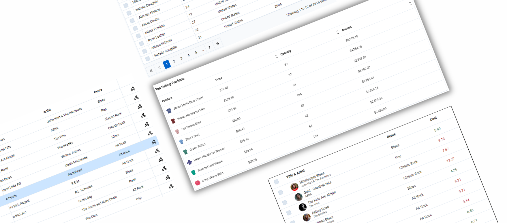
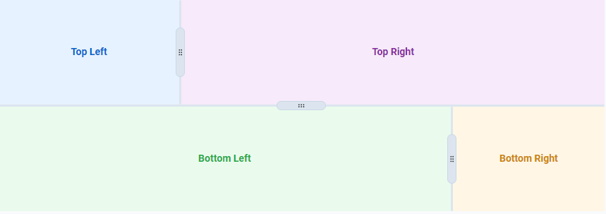

Webforj version 24.00 is live and available for development! Learn more about what main features and fixes are included in this release.

<!-- truncate -->

# 24.00



See the [GitHub release overview](https://github.com/webforj/webforj/releases/tag/24.00) for a more comprehensive list of changes.

### Table component

This release introduces a new [`Table` component](https://documentation.webforj.com/docs/components/table), allowing developers access to a lightweight, fast and optimized way to display their data. 

This table supports tons of modern features, some of which include:

- [Filtering](../docs/components/table/table_filtering.md)
- [Editing](../docs/components/table/table_edit_refresh.md)
- [Sorting](../docs/components/table/table_sorting.md)
- [Lodash rendering](../docs/components/table/table_rendering.md)

Using the `Table` in your app is simple, and follows a few easy steps outlined in [this user guide article](https://documentation.webforj.com/docs/components/table#creating-a-table). We're confident in the positive impact this new component will have in your webforJ applications.

### Navigator component


In addition to the `Table` (and often in conjunction with), the new [`Navigator`](../docs/components/navigator.md) component is available to use in webforJ applications. Perfect for cases in which an app utilizes pagination, the customizable `Navigator` is the perfect pick to allow users to interact with implemented pagination.

It integrates nicely with the `Repository` class, an object of which can be passed in the constructor to take care of binding as soon as the Navigator object is constructed.

```java
Repository<ItemRecord> repository = Service.getItemRecords();
Navigator nav = new Navigator(repository);
```

The `Navigator` can be customized with various settings that configure the text, tooltips, buttons, layouts, and other aspects of the component's appearance. To see a list of these settings, as well as their options, [check out the docs](https://documentation.webforj.com/docs/components/navigator#customizing-buttons-text-and-tooltips) for more details. 

### Splitter component



Rounding out the newly introduced components is the `Splitter`, a tool that allows users to compartmentalize and dynamically resize your app. Whether dividing an entire page, or only a part of the app, the `Splitter` is a great tool with many uses within all types of modern apps.

Among the features included with this component is the ability to automatically save the layout configured by the user when an app is closed, so the splitter maintains its layout when the app is relaunched. Give it a try yourself over at [the docs article](https://documentation.webforj.com/docs/components/splitter#auto-save) which outlines this and many other features.

### Package Renaming

In Version 24.00, we integrated our product's new official brand, webforJ, into the codebase. The previous alias, DWCJ, has been replaced within the framework's package structure. As a result, you will need to update your import statements from org.dwcj to com.webforj when using our framework. New code written shouldn't be affected by the change.