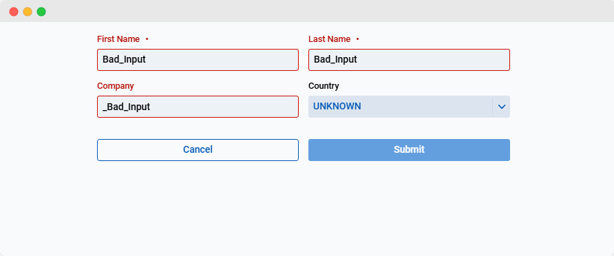

Data binding is a mechanism that connects the UI components of your app directly with the underlying data model, enabling automatic synchronization of values between the two. This eliminates the need for repetitive getter and setter calls, reducing development time and improving code reliability.

Validation, in this context, ensures that the data entered into the form adheres to predefined rules, such as being non-empty or following a specific format. By combining data binding with validation, you can streamline the user experience while maintaining data integrity without writing extensive manual checks.

For more information on data binding reference [this article.](../../data-binding/overview)



### Binding the fields

The data binding setup begins with initializing a `BindingContext` for the `Customer` model. The `BindingContext` links the model properties to the form fields, enabling automatic data synchronization. This is set up in the `FormView` constructor.

```java title="FormView.java"
BindingContext<Customer> context;
context = BindingContext.of(this, Customer.class, true);
```

`BindingContext.of(this, Customer.class, true)` initializes the binding context for the `Customer` class. The third parameter, `true`, enables [jakarta validation](https://beanvalidation.org/).

:::info
This implementation uses auto-binding as described in the [Data Binding Article](../../data-binding/automatic-binding). This works if the fields in the data model `Customer` are named the same as the corresponding fields in the `FormView`.

Should the fields not be named the same you can add the `UseProperty` annotation in the form over the field you want to bind so they know which data fields to refer to.
:::

### Data binding with `onDidEnter()`

The `onDidEnter` method leverages the data binding setup to streamline the process of populating the form fields. Instead of manually setting values for each field, the data is now synchronized automatically with the `BindingContext`.

```java {7}
@Override
  public void onDidEnter(DidEnterEvent event, ParametersBag parameters) {
    parameters.get("id").ifPresent(id -> {
      customer = Service.getCurrent().getCustomerByKey(UUID.fromString(id));
      customerId = id;
    });
    context.read(customer);
  }
```

The `context.read` method in webforJ's data binding system synchronizes the fields of a UI component with the values from a data model. It's used in this case to populate form fields with data from an existing model, ensuring the UI reflects the current state of the data.

## Validating data

Validation ensures that the data entered into the form adheres to specified rules, improving data quality and preventing invalid submissions. With data binding, validation no longer needs to be manually implemented but instead simply configured, allowing real-time feedback on user inputs.

### Defining validation rules

Using [Jakarta](https://beanvalidation.org) and regular expressions, you can enforce a multitude of rules on a field. Often used examples would be ensuring the field
isn't empty or null, or follows a certain pattern.
Through annotations in the customer class you can give jakarta validation parameters to the field.

:::info
More details regarding the setup of the validation is available [here](../../data-binding/validation/jakarta-validation.md#installation).
:::

```java
  @NotEmpty(message = "Name cannot be empty")
  @Pattern(regexp = "[a-zA-Z]*", message = "Invalid characters")
  private String firstName = "";
```

The `onValidate` method is then added to control the `Submit` button's state based on the validity of the form fields. This ensures that only valid data can be submitted.

```java title="FormView.java"
context.onValidate(e -> submit.setEnabled(e.isValid()));
```

`e.isValid()` returns true if all fields are valid, and false if not. This means that the `Submit` button is enabled as long as all fields are valid. Otherwise, it remains turned off, preventing submission until corrections are made.

### Adding and editing entries with validation

The `submitCustomer()` method now validates data using the `BindingContext` before performing add or edit operations. This approach eliminates the need for manual validation checks, leveraging the context's built-in mechanisms to ensure that only valid data is processed.

- **Add Mode**: If no `id` is provided, the form is in add mode. The validated data is written to the `Customer` model and added to the repository via `Service.getCurrent().addCustomer(customer)`.
- **Edit Mode**: If an `id` is present, the method retrieves the corresponding customer data, updates it with validated inputs, and commits the changes to the repository.

Calling `context.write(customer)` will return an instance of a `ValidationResult`. This class indicates whether or not the validation was successful, and stores any messages associated with this result.

This code ensures that all changes are validated and automatically applied to the model before being adding a new or editing an existing `Customer`.

```java title="FormView.java"
private void submitCustomer() {
  ValidationResult results = context.write(customer);
  if (results.isValid()) {
    if (customerId.isEmpty()) {
      Service.getCurrent().addCustomer(customer);
    }
    Router.getCurrent().navigate(DemoView.class);
  }
}
```

By completing this step, the app now supports data binding and validation, ensuring that form inputs are synchronized with the model and adhere to predefined rules.
